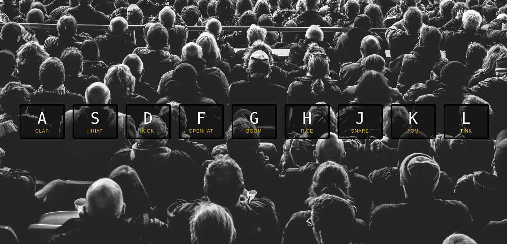

# JS Drum kit

A very simple vanilla JS based drum kit.

```
Use keys 'a', 's', 'd', 'f', 'g', 'h', 'j', 'k' and 'l' to produce various drum sounds.
```


### ScreenShot



#### voilà! Thats it.  
#### Enjoy!